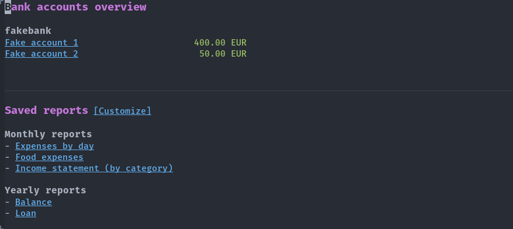
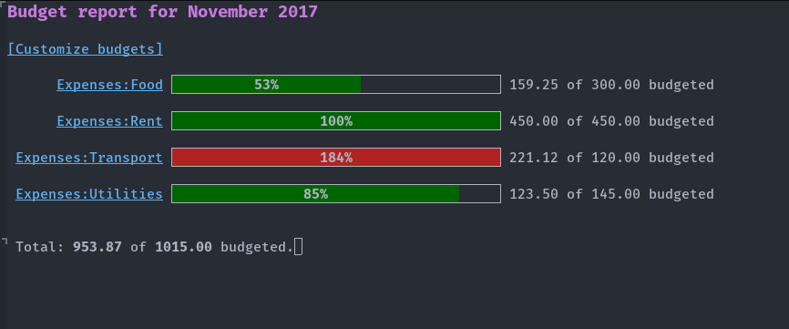
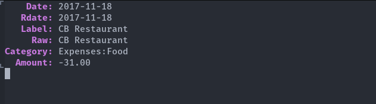

# Elbank 
[](https://gitlab.petton.fr/nico/elbank/commits/master) 
[](https://www.gnu.org/software/emacs/)

## Summary

Elbank is a personal finances reporting tool for Emacs.  It uses
[Weboob](https://weboob.org) for scraping data from bank websites.

## Screenshots

##### Overview buffer



##### Report example (by category)


#### Budget reports



##### Transaction details



## Installing

You will need Emacs 25+.

- [Install Weboob](http://weboob.org/install) and run `boobank` configure your
  bank accounts;
  
- Install Elbank from [MELPA](http://melpa.org/#/elbank).

- Run `M-x elbank-overview`.

Note: Make sure to enter your username and password (or an automated script)
during the `boobank` setup, so that `boobank` can retrieve transactions without
asking for them.  This is currently required as Elbank will not interactively
ask for usernames or passwords.

### Weboob and passwords

If you do not want to store your passwords in Weboob, it is also possible to use
a password manager like [pass](https://www.passwordstore.org/). During the setup
of boobank, you can set the password to run an external command like:

```
pass bank_website
```

## Usage

### Data file

Data is stored as JSON in `elbank-data-file` which defaults to
`$HOME/.emacs.d/elbank-data.json`. 

You might want to customize that variable or make sure to **exclude it from your
`.emacs.d` git repository**.

### Entry point

The command `elbank-overview` is the entry point of Elbank.  You might want to
bind it to a global key like the following:

```emacs-lisp
(global-set-key (kbd "C-c e") #'elbank-overview)
```

Otherwise just do `M-x elbank-overview RET` to get started.  The overview buffer
lists all bank accounts with their current balance and a link to each account
statements report.

From the overview buffer, press `r` to create a new report.

### Importing data

Before using Elbank, make sure that `weboob` is correctly configured.  You can
make sure of it by evaluating `$ boobank ls` and see if your bank accounts are
correctly outputted.

When opening the overview buffer for the first time, Elbank will scrap data
using weboob.  Press `u` to update data from weboob.

Note: Many bank website only store data for a short period of time (usually just
a few months), so make sure to **import on a regular basis**, otherwise there
will be gaps in the list of transactions.

### Categorizing transactions

Categorizing transactions is important when reporting with Elbank.  It makes it
easy to group or filter transactions based on their categories.

Transactions are automatically categorized when reporting, using
`elbank-categories`, an association list of the form:

```emacs-lisp
'(("category1" . ("regexp1" "regexp2"))
  (("category2" . ("regexp")))
```

Where a category key can be any string.  Category regexps are matched against
transaction labels or raw text.

For convenience when filtering transactions by categories, it is recommended to
create categories with subcategories using ":" as a separator in category keys,
like in the following example:

```emacs-lisp
(setq elbank-categories
      '(("Expenses:Food" . ("^supermarket" 
                            "^restaurant" 
                            "Local store XXX" 
                            "Bakery XXX"))
        ("Expenses:Rent" . ("Real Estate Agency XXX"))
        ("Income:Salary" . ("Bank transfer from Company XXX"))))
```

Note that it is not currently possible to manually add a category to a specific
transaction, you always have to rely on `elbank-categories` to categorize
transactions.

### Categorizing single transactions

To set a custom category to a specific transaction, go to a transaction row in
any report and press `c`.

Transactions with a custom category will override any matching category from
`elbank-categories`.

### Customizing reports

Many report options can be customized from within a report buffer.

- `f c`: Filter transactions by category, or a prefix of a category.
- `f p`: Filter transactions by a period (leave empty for no period).
- `f a`: Only show transactions for a specific account.
- `S`: Select the sort column.
- `s`: Reverse the sorting order.
- `G`: Group transactions by a property (leave empty for no grouping).
- `M-n`: Move forward by one period.
- `M-p`: Move backward by one period.

You can customize `elbank-saved-monthly reports` and
`elbank-saved-yearly-reports` to get a quick list of commonly used reports from
the overview buffer.

### Example reports

Here are some example reports:

- All transactions with default columns (date, label, category and amount)
```elisp
(elbank-report)
```

- All transactions with raw text
```elisp
(elbank-report :columns '(date label raw amount))
```
- Monthly income statement by category
```elisp
(elbank-report :sort-by 'amount
               :group-by 'category
               :columns '(date label amount)
               :period `(month ,@(last (elbank-transaction-months))))
```
- Daily expenses of the current month
```elisp
(elbank-report :sort-by 'date
               :group-by 'date
               :columns '(label category amount)
               :period `(month ,@(last (elbank-transaction-months))))
```

## Budgeting

Monthly Budgets are specified with `elbank-budget`, an assocation list of the form:

```elisp
'(("category1" . amount)
  ("category2" . amount))
```

To open a budget report, press `b` from the overview buffer or `M-x elbank-budget-report`.

## Contributing

Yes, please do! See [CONTRIBUTING][] for guidelines.

## License

See [COPYING][]. Copyright (c) 2017-2018 Nicolas Petton.


[CONTRIBUTING]: ./CONTRIBUTING.md
[COPYING]: ./COPYING
